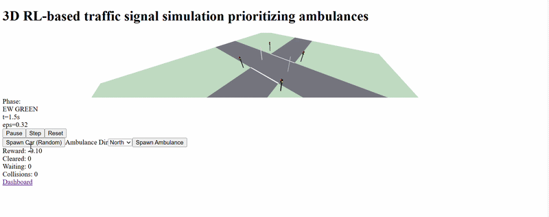

# 🚦 3D Reinforcement Learning-Based Traffic Signal Control System Prioritizing Ambulances

A professional, interactive AI-powered traffic management platform for real-time traffic optimization using Reinforcement Learning concepts and intelligent simulation. The system dynamically controls traffic signals, prioritizes emergency vehicles, and provides interactive 3D visualization with real-time analytics.

---

## 🎥 Live Demo



🔗 Live Demo: [Add Your Vercel Link Here]

---

## 📌 Overview

Traditional traffic systems rely on fixed timing mechanisms that often struggle during congestion and emergency situations. This project simulates an adaptive traffic signal system capable of dynamically managing traffic flow and prioritizing ambulances using RL-style state-action-reward logic and interactive simulation.

---

## 🚀 Features

🧠 Adaptive Traffic Signal Control using intelligent state-based logic

🚑 Ambulance Priority System with emergency vehicle handling

🌐 Interactive 3D Traffic Visualization using React Three Fiber

📊 Real-time Dashboard Analytics and simulation monitoring

⚡ Dynamic Traffic Flow Optimization

🛡 Collision-aware movement and safety handling

🔄 Real-time simulation updates

💻 Modern responsive interface with modular architecture

---

## 🛠️ Setup Instructions

### Prerequisites

- Node.js 18+
- npm package manager
- Git

### Installation

Clone repository

```bash
git clone https://github.com/abiramisanthi/3D-RL-Traffic-Signal-Control-System.git

cd 3D-RL-Traffic-Signal-Control-System
```

Install dependencies

```bash
npm install
```

Run development server

```bash
npm run dev
```

Open:

```bash
http://localhost:3000
```

---

## 📦 Project Structure

```plaintext
3D-RL-Traffic-Signal-Control-System
│
├── app/
│   └── traffic/
│
├── components/
│   └── traffic/
│       ├── ClientTrafficSim.tsx
│       ├── ErrorBoundary.tsx
│       ├── three-scene.tsx
│       ├── traffic-sim-app.tsx
│       └── use-traffic-sim.ts
│
├── public/
│   └── rl-sim/
│       └── scripts/
│            └── rl_env.py
│
├── lib/
├── package.json
├── tsconfig.json
├── tailwind.config.js
└── README.md
```

---

## 🧠 Models & Simulation

### Reinforcement Learning Components

- RL-style State → Action → Reward workflow
- Dynamic traffic decision simulation
- Browser-based adaptive signal logic
- Emergency vehicle prioritization
- Lightweight Python RL environment

### Simulation Capabilities

- Real-time vehicle movement
- Dynamic traffic behavior
- Interactive 3D rendering
- Live dashboard metrics

---

## 📈 System Capabilities

| Feature | Status |
|----------|----------|
| Traffic Signal Simulation | ✅ |
| Ambulance Prioritization | ✅ |
| Interactive 3D Environment | ✅ |
| Dashboard Analytics | ✅ |
| Dynamic Traffic Updates | ✅ |
| RL-style Logic | ✅ |

---

## 🔒 Safety Features

- Collision-aware movement logic
- Emergency vehicle prioritization
- Dynamic traffic state validation
- Real-time simulation handling
- Safety constraints implementation

---

## 🌟 Key Technologies

### Frontend

- Next.js
- React
- TypeScript
- Tailwind CSS

### State Management

- Zustand

### UI Components

- Radix UI
- React Hook Form
- Zod

### Visualization

- React Three Fiber
- Three.js
- Recharts
- WebGL

### AI / Simulation

- Reinforcement Learning concepts
- Python RL environment
- Traffic simulation engine

### Deployment

- Vercel
- GitHub

---

## 🚀 Future Enhancements

📱 Mobile dashboard support

🌐 Multi-intersection traffic networks

☁️ Cloud analytics integration

🧠 Deep Reinforcement Learning expansion

📡 IoT traffic sensor integration

🏙 Smart city deployment

---

## 📄 License

This project is licensed under the MIT License — see LICENSE for details.

---

## 👩‍💻 Author

**Abirami Karunakaran**

AI & ML Engineering Student

GitHub: https://github.com/abiramisanthi

---

## 💡 Elevator Pitch

Developed an AI-powered adaptive traffic signal simulation system using Next.js, TypeScript, and interactive 3D visualization with intelligent emergency vehicle prioritization and RL-inspired traffic decision logic.

---

## 🙏 Acknowledgments

React Three Fiber ecosystem for 3D rendering

Next.js for frontend architecture

Open-source community libraries and simulation resources
